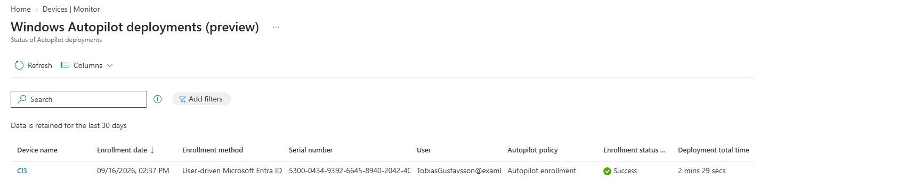
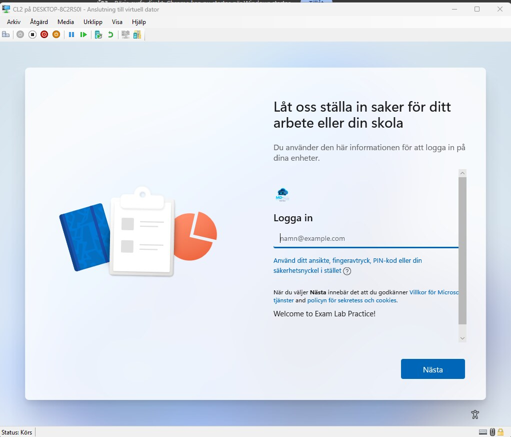
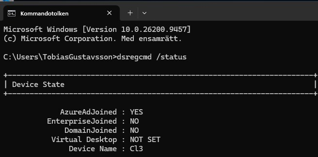

# 01 Windows Autopilot

**Resultat:** Autopilot-rapporten visar `Success`. Klienten är Intune-hanterad och den lokala kontrollen visar `AzureAdJoined : YES`.

## Mål och konfiguration

Jag byggde ett användardrivet provisioneringsflöde för en Windows 11-enhet. Målet var att låta organisationens profil styra första uppstarten och ansluta klienten till Microsoft Entra ID.

| Del | Val i labben |
| :--- | :--- |
| Registrering | Enhetens hardware hash importerades i Windows Autopilot |
| Distributionsläge | User-Driven med Microsoft Entra join |
| Användartyp | Standardanvändare |
| Region | Sverige med automatisk tangentbordskonfiguration |
| Enrollment Status Page | Installationsstatus, diagnostik och tidsgräns på 60 minuter |

## Genomförande

1. Jag registrerade enheten och tilldelade distributionsprofilen till en enhetsgrupp.
2. Jag förberedde den virtuella klienten för OOBE och genomförde arbets- eller skolinloggningen.
3. Jag följde enhetskonfigurationen, uppdateringarna och konfigurationen av Windows Hello for Business.
4. Jag verifierade distributionen i Intune och enhetsidentiteten lokalt.

## Verifiering



Rapporten visar `Success`. Den rapporterade distributionstiden är 2 minuter och 29 sekunder; det värdet används inte som mått på hela installationen inklusive samtliga OOBE-steg och uppdateringar.

```powershell
dsregcmd /status
```

Den lokala kontrollen visar `AzureAdJoined : YES` för CL3.

<details>
<summary>Visa OOBE och lokal identitetskontroll</summary>





</details>

## Lärdom

Autopilot-registrering, Intune-hantering och Microsoft Entra join är olika delar av flödet. Jag kontrollerade dem separat för att kunna skilja en tilldelad profil från en färdig och hanterad klient.

---

[Projektöversikt](../README.md) · [Nästa projekt](../02-BitLocker-Windows-LAPS/)
