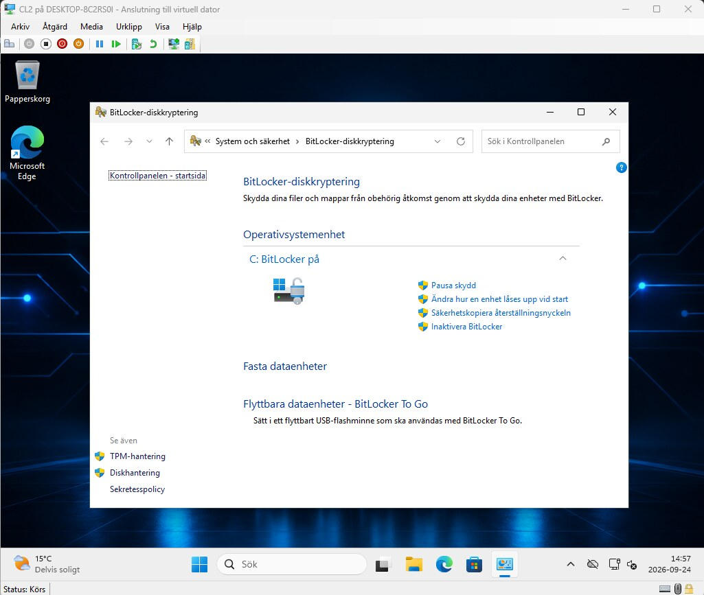
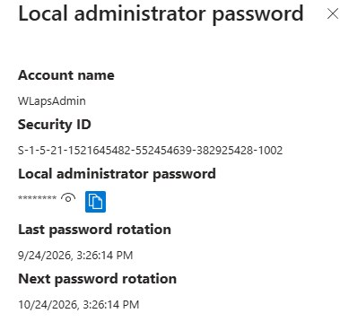
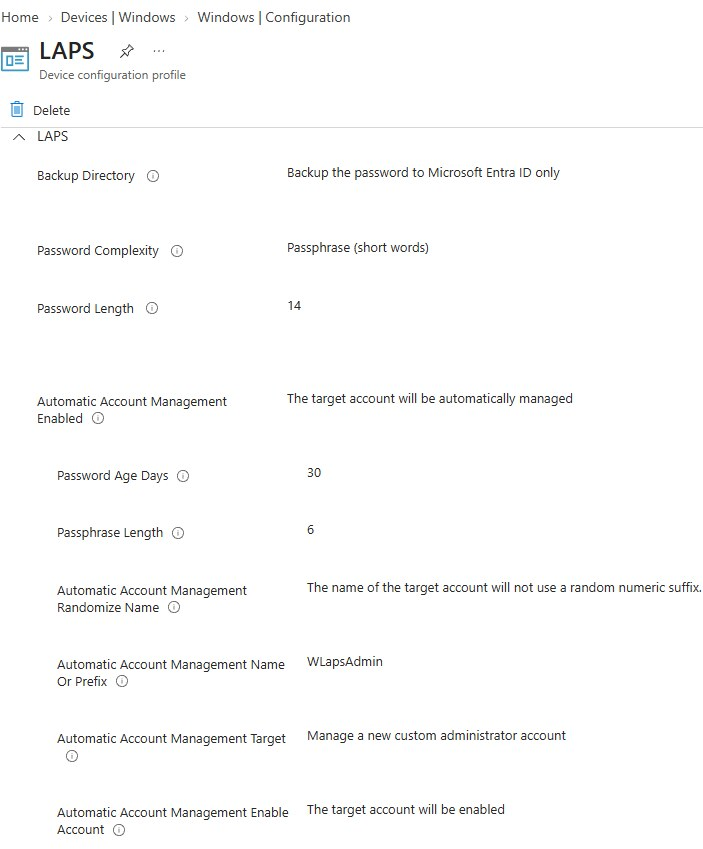
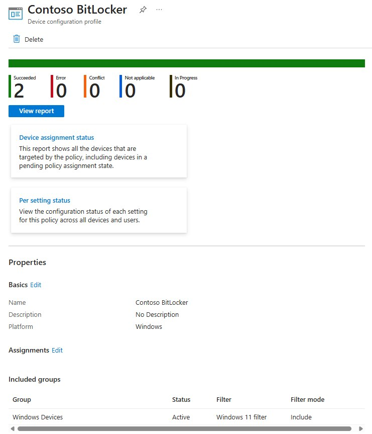
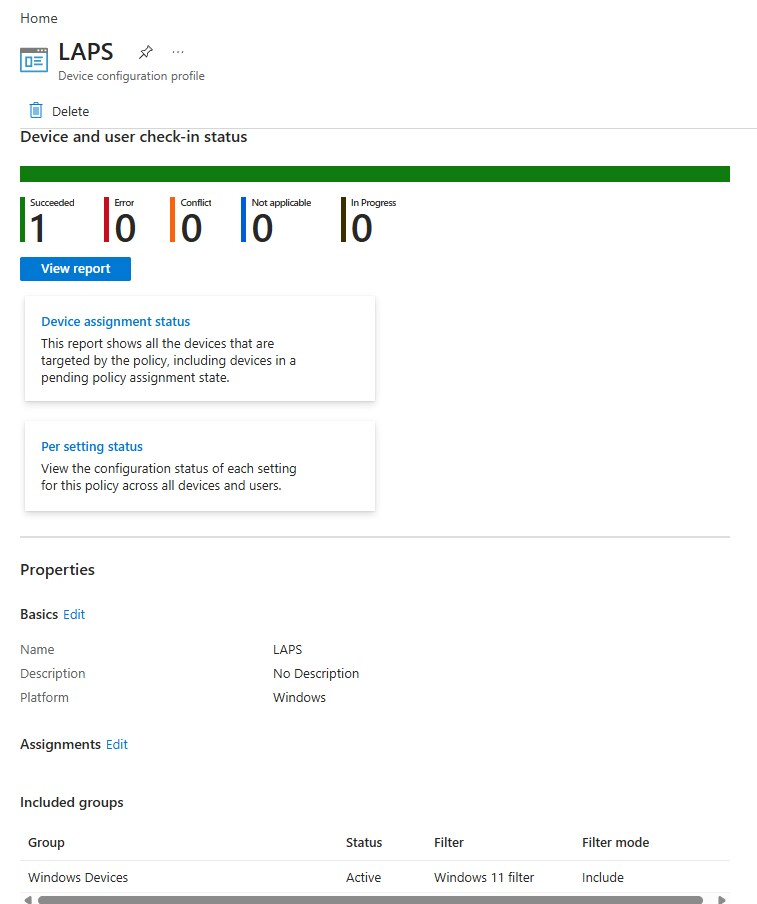

# 02 BitLocker och Windows LAPS

**Resultat:** BitLocker är aktivt på C:. LAPS visar kontot `WLapsAdmin` med lagrat lösenord samt senaste och nästa rotation. Båda policyerna rapporterar lyckad tillämpning.

## Mål och konfiguration

Jag konfigurerade diskkryptering och ett centralt hanterat lokalt administratörskonto. Målet var att skydda data på klienten och undvika ett statiskt administratörslösenord.

| Del | Val i labben |
| :--- | :--- |
| BitLocker | Krav på enhetskryptering och konfiguration av operativsystemdisken |
| Startautentisering | TPM och alternativa startmetoder tillåtna; start-PIN inte obligatorisk |
| Windows LAPS | Automatisk kontohantering för `WLapsAdmin` |
| Lösenordsbackup | Microsoft Entra ID |
| Lösenordspolicy | Lösenordsfras med sex ord och 30 dagars lösenordsålder |
| Tilldelning | Enhetsgrupp med Windows 11-filter |

## Genomförande

Jag skapade separata profiler för BitLocker och Windows LAPS, konfigurerade inställningarna och riktade tilldelningen till Windows-enheter. Efter att Intune rapporterade lyckad tillämpning kontrollerade jag krypteringsstatus på klienten och LAPS-postens rotationsinformation.

## Verifiering

| Kontroll | Resultat |
| :--- | :--- |
| BitLocker-policy | Två lyckade tillämpningar, inga fel eller konflikter |
| LAPS-policy | En lyckad tillämpning, inga fel eller konflikter |
| Klientkontroll | `C: BitLocker på` |
| LAPS-post | Kontonamn, maskerat lösenord och rotationsdatum visas |

Visa LAPS-konfiguration och policyrapporter

## Lärdom och nästa test

En lyckad policytillämpning behöver kompletteras med kontroll av klientens krypteringsstatus. LAPS-lösenord och BitLocker-återställningsinformation är också separata delar som måste verifieras var för sig.

BitLocker-profilen innehöll alternativ för ett återställningslösenord med 48 siffror och AD DS-specifika inställningar. Nästa steg är att anpassa återställningsvalen för den Entra-anslutna miljön och verifiera backup, hämtning och återställning. Något genomfört återställningstest redovisas inte här.

---

[Projektöversikt](../README.md) · [Föregående projekt](../01-Windows-Autopilot/) · [Nästa projekt](../03-Win32-App-Deployment/)
