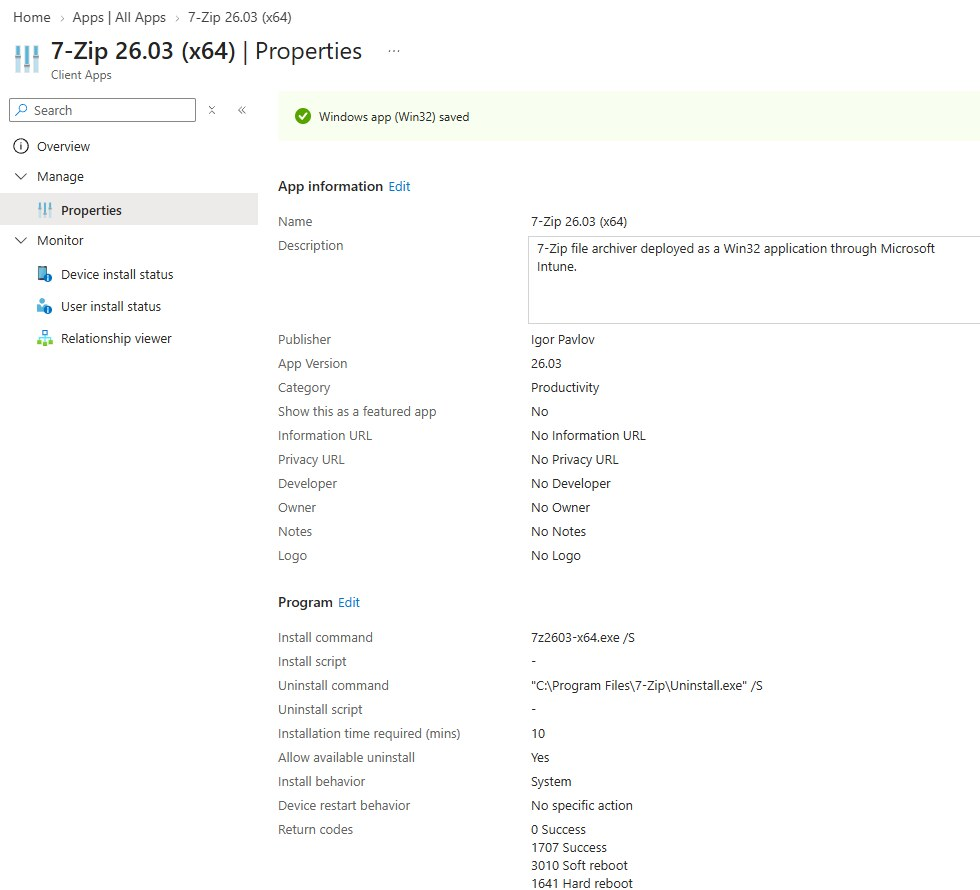
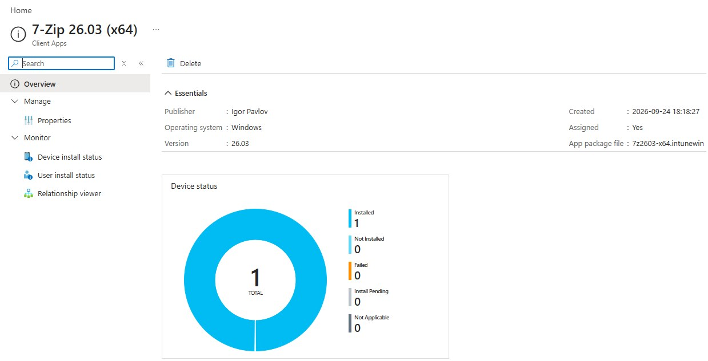
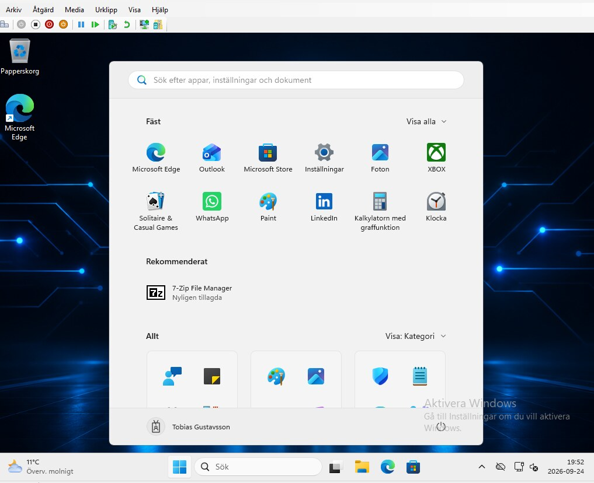

# Projekt 03 · Win32-appdistribution

## Syfte

Paketera, distribuera och verifiera en traditionell Windows-applikation genom Microsoft Intune.

## Genomförande

- Paketerade 7-Zip 26.03 x64 som en `.intunewin`-fil.
- Konfigurerade tysta installations- och avinstallationskommandon.
- Använde systemkontext och x64-krav för installationen.
- Skapade en filbaserad identifieringsregel för den installerade applikationen.
- Tilldelade applikationen till gruppen med hanterade Windows-enheter.

## Resultat

Intune rapporterade en installerad enhet utan fel. Applikationen var även synlig i Start-menyn på Windows 11-klienten, vilket verifierade hela distributionskedjan från moln till klient.

### Applikationskonfiguration

### Installationsstatus i Intune

### Verifiering på klienten

[Tillbaka till portfolion](../README.md)

