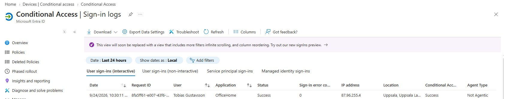
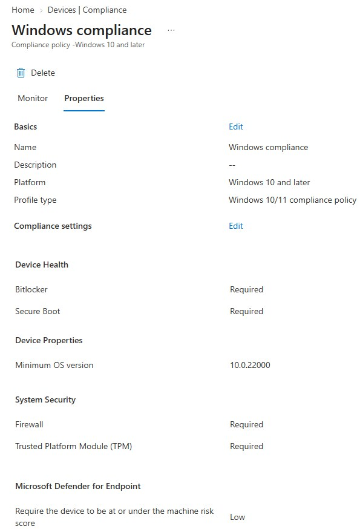
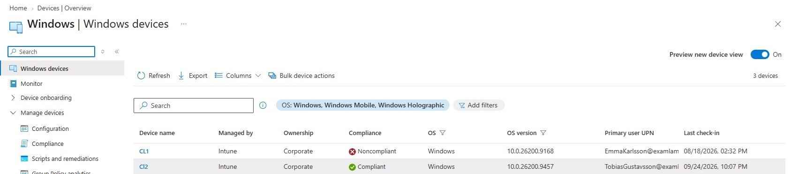

# 04 Efterlevnad och Conditional Access

**Resultat:** CL2 visas som `Compliant`. Efter korrigerad resursomfattning visar en ny OfficeHome-inloggning Conditional Access-status `Success`.

## Mål och konfiguration

Jag kopplade säkerhetskrav i Intune till ett åtkomstvillkor i Microsoft Entra ID. Målet var att använda enhetens efterlevnadsstatus vid bedömning av åtkomst till molnresurser.

| Del | Val i labben |
| :--- | :--- |
| Enhetshälsa | BitLocker och Secure Boot krävs |
| Systemsäkerhet | Brandvägg och TPM krävs |
| Minsta OS-version | `10.0.22000` |
| Maskinrisk | Low eller lägre konfigurerat i efterlevnadspolicyn |
| Åtgärd vid avvikelse | Mark device noncompliant: Immediately |
| Tilldelning | Win devices med Windows 11-filter |
| Åtkomstkrav | Require device to be marked as compliant |

## Felsökning

Första inloggningstestet gav `Not Applied` trots att CA-policyn var aktiverad. Jag öppnade policydetaljerna i inloggningsloggen och såg att resursen inte ingick. Jag ändrade målresurserna till **All resources** och testade igen.

| Steg | Observation och slutsats |
| :--- | :--- |
| Symtom | Inloggningen visade `Not Applied` trots att policyn var On. |
| Undersökning | Policydetaljerna visade `Resource: Not matched` och `Not included`. Det gav en konkret avvikelse att undersöka i resursomfattningen. |
| Åtgärd | Jag ändrade målresurserna till All resources och behöll kravet på compliant enhet. |
| Omtest | En ny OfficeHome-inloggning visade CA-status `Success`. |
| Avgränsning | Det lyckade testet behöver kompletteras med ett separat test av nekad åtkomst. |

## Verifiering

Visa efterlevnadspolicyn och enheternas status

## Lärdom och nästa test

Läget On räcker inte för att en CA-policy ska träffa en viss inloggning. Resurs, tilldelning och villkor behöver matcha testet. Inloggningsloggens policydetaljer gav underlag för att hitta avvikelsen.

Den dokumenterade inloggningen visar ett godkänt test. Ett separat test av nekad åtkomst från en noncompliant enhet återstår. Kravet på maskinrisk är konfigurerat; separat riskrapportering från Defender for Endpoint verifieras inte av bilderna här.

---

[Projektöversikt](../README.md) · [Föregående projekt](../03-Win32-App-Deployment/) · [Nästa projekt](../05-Defender-Endpoint-Security/)
