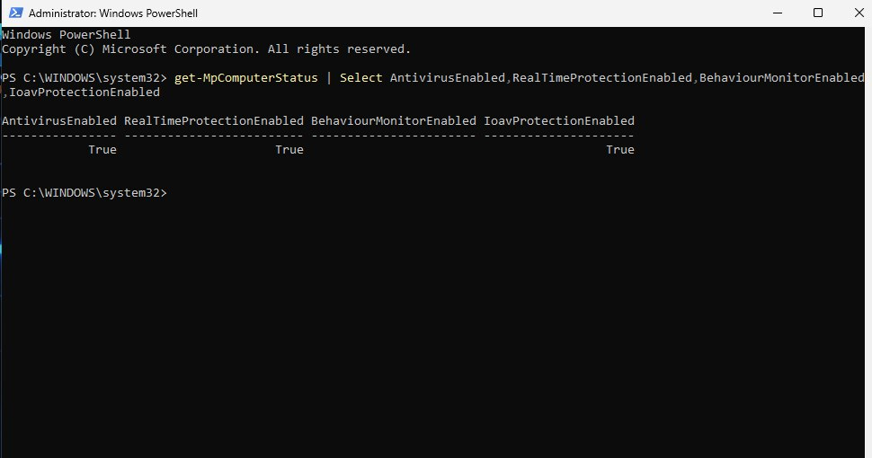
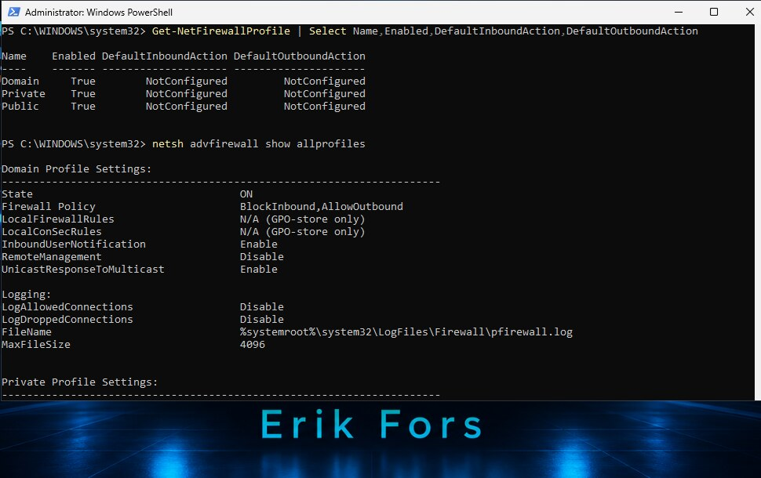
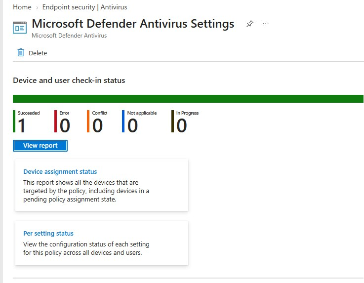
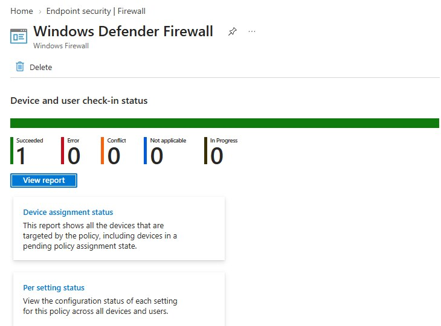

# 05 Microsoft Defender Antivirus och Windows Firewall

**Resultat:** Båda policyerna rapporterar `1 Succeeded` utan fel eller konflikter. Lokala kontroller visar aktivt antivirusskydd och aktiverade brandväggsprofiler.

## Mål och konfiguration

Jag skapade separata antivirus- och brandväggspolicyer för en hanterad Windows 11-klient. Målet var att styra klientskyddet centralt och sedan kontrollera vad klienten faktiskt rapporterade.

### Antivirus

| Inställning | Val i labben |
| :--- | :--- |
| Cloud Block Level | High |
| PUA Protection | Blockering av upptäckta potentiellt oönskade appar |
| Skanning | Daglig snabbskanning och dubbelriktad realtidsskanning |
| Network Protection | Audit mode för utvärdering |

Network Protection i audit mode registrerar händelser utan att blockera anslutningar. Projektet visar konfigurationen av detta läge; något verifierat blockeringstest redovisas inte.

### Brandvägg

| Nätverksprofil | Dokumenterat konfigurationsval |
| :--- | :--- |
| Domain | Aktiverad; standard in Block och ut Allow |
| Private | Aktiverad; standard in Block |
| Public | Aktiverad; standard ut Allow |

Lokala regler fick slås samman med policyn. Loggning av lyckade anslutningar och tappade paket var avstängd i labbkonfigurationen.

## Verifiering



Skärmbilden visar `True` för `AntivirusEnabled`, `RealTimeProtectionEnabled` och `IoavProtectionEnabled`. Den bekräftar inte beteendeövervakning: den kolumnen saknar värde i den dokumenterade kontrollen.

```powershell
Get-NetFirewallProfile | Select-Object Name, Enabled, DefaultInboundAction, DefaultOutboundAction
netsh advfirewall show allprofiles
```



### Felsökning av lokal brandväggsstatus

| Steg | Observation och slutsats |
| :--- | :--- |
| Första kontrollen | Alla tre profiler visade `Enabled: True`, men standardåtgärderna visades som `NotConfigured`. |
| Kompletterande kontroll | Jag använde `netsh advfirewall show allprofiles` för att få ytterligare underlag om den lokala brandväggsstatusen. |
| Resultat | Den synliga Domain-profilen visade `ON` och `BlockInbound,AllowOutbound`. |
| Avgränsning | Bilden verifierar Domain-profilens standardåtgärder. Motsvarande värden för Private och Public samt trafiktester behöver dokumenteras separat. |

Jag kunde därmed skilja uppgiften om aktiverade profiler från uppgiften om deras standardåtgärder och undvika att dra slutsatsen att brandväggen var avstängd.

<details>
<summary>Visa distributionsrapporterna för båda policyerna</summary>





</details>

## Lärdom

Policyrapportering och lokal status behöver läsas tillsammans. Jag skiljer därför mellan lyckad distribution, konfigurerade skyddsfunktioner och verifierat klientbeteende. Nästa steg är att utvärdera Network Protection-händelser och testa brandväggsreglernas effekt på faktisk trafik.

---

[Projektöversikt](../README.md) · [Föregående projekt](../04-Compliance-Conditional-Access/) · [Nästa projekt](../06-PowerShell-Automation/)
