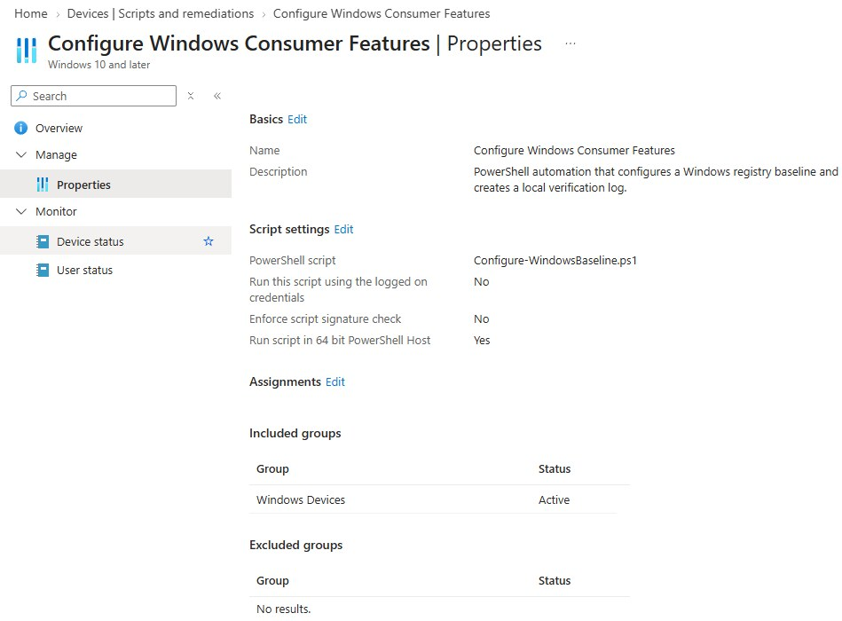
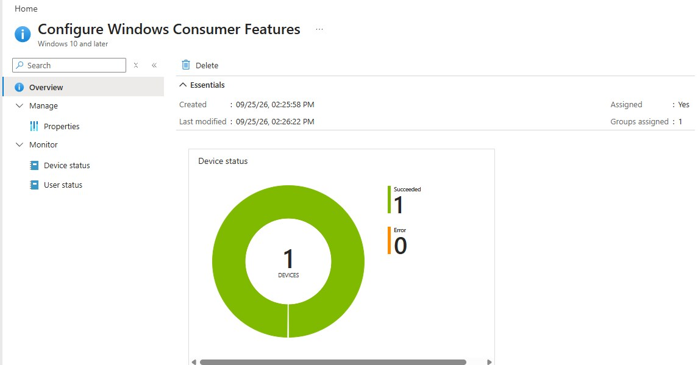
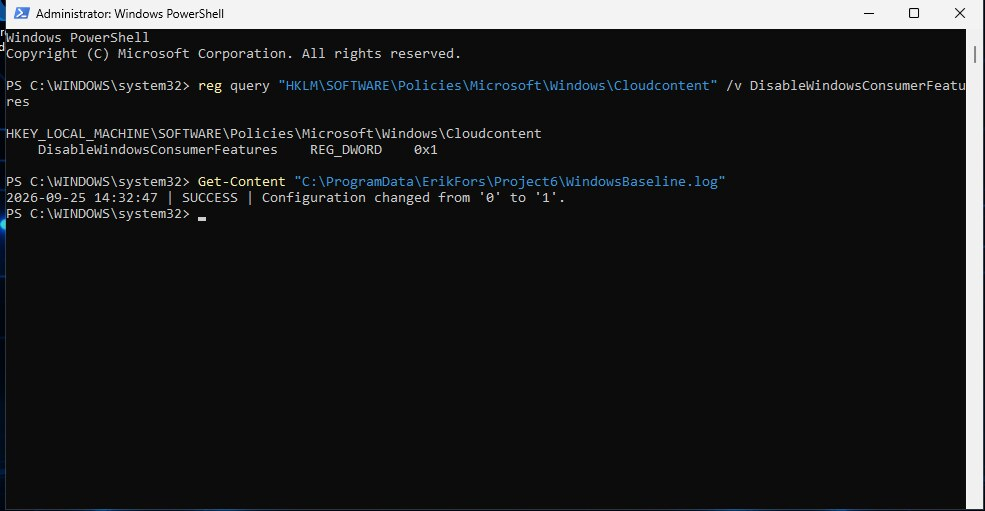

# Project 06 · PowerShell automation with Intune

## Objective

Use an Intune Platform script to apply a computer-level Windows baseline in system context and create durable local evidence of the change.

## Implementation

- Created an idempotent PowerShell script.
- Set `DisableWindowsConsumerFeatures` under the Windows CloudContent policy key.
- Ran the script without the signed-in user's credentials in 64-bit PowerShell.
- Assigned the script to the Windows device group.
- Wrote a local audit log under `C:\ProgramData\ErikFors\Project6`.

This project uses an Intune **Platform script**, not Proactive Remediations, because Remediations was not available in the lab tenant.

## Result

Intune reported one successful device execution and no errors. The registry value changed from `0` to `1`, and the local log recorded a `SUCCESS` entry with the before-and-after values.

[View the PowerShell source](scripts/Configure-WindowsBaseline.ps1)

### Script configuration

### Intune execution result

### Local verification and log

[Back to portfolio](../README.md)

