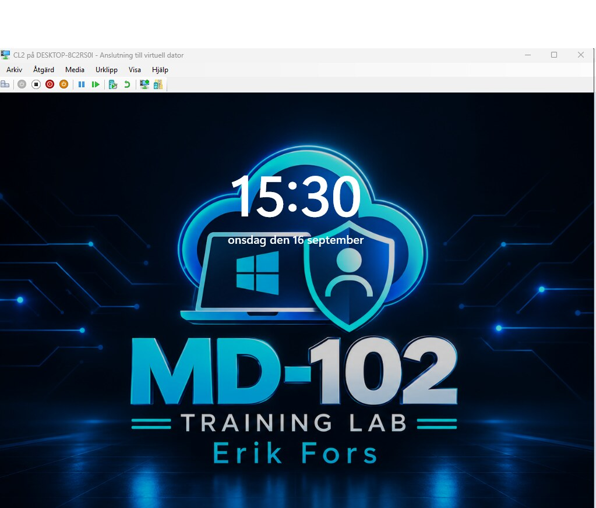

# Portfolio – Microsoft Endpoint Management

Praktisk portfolio inom Microsoft Intune och Microsoft Entra ID av **Erik Fors**.

Det här repot dokumenterar sex praktiska projekt som genomförts i en separat labbtenant med hanterade virtuella Windows 11-klienter. Arbetet omfattar provisionering, säkerhet, applikationsdistribution, efterlevnad, åtkomstkontroll och PowerShell-automatisering.

[Ladda ned den kompletta portfolion (PDF)](docs/Erik-Fors-Microsoft-Endpoint-Portfolio.pdf)

## Projekt

| Projekt | Omfattning | Verifierat resultat |
|---|---|---|
| [01 · Windows Autopilot](01-Windows-Autopilot/) | Hardware hash, distributionsprofil, OOBE och Entra-anslutning | Lyckad användardriven distribution och hanterad enhetsstatus |
| [02 · BitLocker och Windows LAPS](02-BitLocker-Windows-LAPS/) | Diskkryptering, återställning och hanterad lokal administratör | Policyerna tillämpades, OS-disken krypterades och LAPS-lösenordet roterades |
| [03 · Win32-appdistribution](03-Win32-App-Deployment/) | Paketering och distribution av 7-Zip | Applikationen installerades och rapporterades som installerad i Intune |
| [04 · Efterlevnad och villkorsstyrd åtkomst](04-Compliance-Conditional-Access/) | Enhetshälsa och åtkomstkrav | Enheten blev compliant och Conditional Access utvärderades framgångsrikt |
| [05 · Defender Endpoint Security](05-Defender-Endpoint-Security/) | Microsoft Defender Antivirus och Windows Defender Firewall | Policyerna lyckades och det effektiva skyddet verifierades lokalt |
| [06 · PowerShell-automatisering](06-PowerShell-Automation/) | Intune Platform script i systemkontext | Registerbaslinjen ändrades, loggades lokalt och rapporterades som lyckad |

## Tekniker

- Microsoft Intune
- Microsoft Entra ID och Conditional Access
- Windows Autopilot
- Windows 11 Enterprise
- Microsoft Defender Antivirus och Windows Defender Firewall
- BitLocker och Windows LAPS
- Win32 Content Prep Tool
- PowerShell

## Verifieringsmetod

Varje projekt stöds av bevis från minst två nivåer: rapportering i Intune eller Entra samt lokal verifiering i Windows. Exempel är distributionsrapporter, enhetsstatus, inloggningsloggar, `dsregcmd`, registerfrågor, `Get-MpComputerStatus` och `Get-NetFirewallProfile`.

> Detta är en utbildnings- och labbportfolio. Namn, grupper och policyer är labbresurser och inte produktionssystem.

